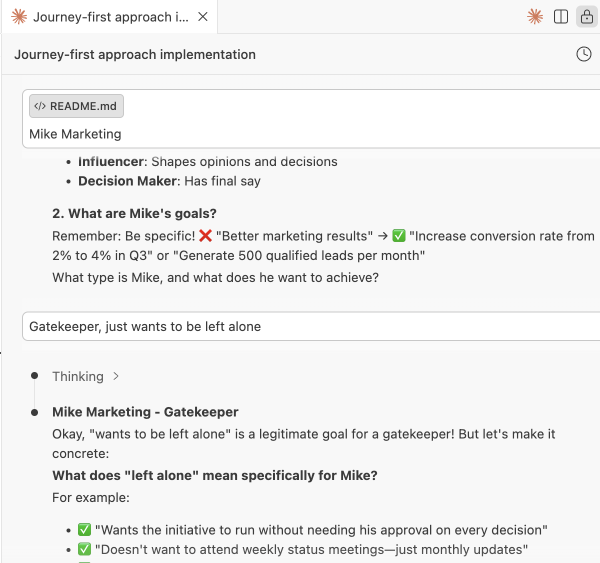

## journey-first

This tool helps you get a clear and detailed customer journey - and get the insights out to everyone in your team. Fully free (and open source - feel free to look under the hood).

### Claude Code Skill

**New!** If you use [Claude Code](https://claude.ai/code), you can now use the Journey First coaching skill to create customer journeys directly in your terminal. The skill coaches you through all 6 steps (Stakeholders, SPIN analysis, Journey Steps, Walkthrough, Realization, Signoff) and ensures your answers are concrete and actionable.

**Usage**: Clone this repo and run `/journey-first` in Claude Code to start the interactive journey creation process. The skill generates markdown documentation and can optionally create a Reveal.js presentation.

**Sample Output**: See [claude-sample.md](claude-sample.md) for example markdown output with ASCII chevron diagram, or open [claude-sample-pres.html](claude-sample-pres.html) in your browser for the interactive presentation.

See [.claude/skills/journey-first/](.claude/skills/journey-first/) for the skill definition.

### Web Application

[https://sebastianrothbucher.github.io/journey-first/journey](https://sebastianrothbucher.github.io/journey-first/journey)

### License

MIT